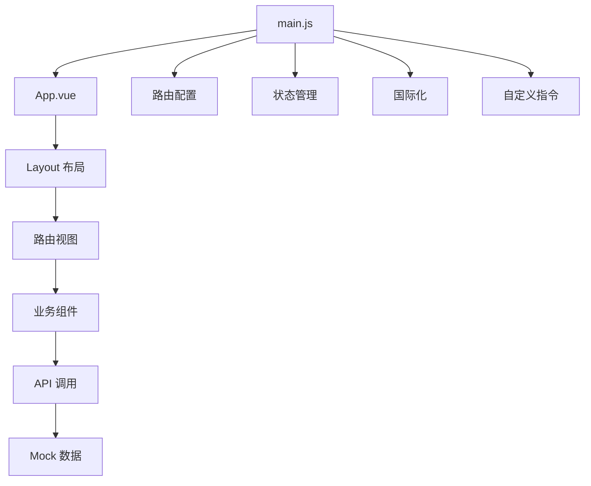

# vue-diverse-admin 项目说明文档

## 1. 项目概述

vue-diverse-admin 是一个基于 Vue3、TypeScript、Vite3、Element-Plus 开发的后台管理系统模板，提供了丰富的功能和灵活的布局选项，可用于快速构建企业级管理系统。

- **现代化技术栈**：采用 Vue3 Composition API、Vite4 构建工具、Element Plus UI 库
- **灵活的布局系统**：支持 4 种布局模式（垂直、经典、横向、分栏）
- **完整的功能模块**：包含权限管理、主题系统、国际化、数据可视化等
- **丰富的组件库**：内置多种常用组件和工具

## 2. 技术栈

| 类别 | 技术/库 | 版本 | 用途 |
|------|---------|------|------|
| 核心框架 | Vue | ^3.3.4 | 前端核心框架 |
| 构建工具 | Vite | ^4.4.5 | 项目构建和开发服务器 |
| 状态管理 | Pinia | ^2.0.12 | 状态管理工具 |
| 路由管理 | Vue Router | ^4.0.12 | 路由管理 |
| UI 库 | Element Plus | ^2.2.17 | UI 组件库 |
| HTTP 客户端 | Axios | ^0.27.2 | API 调用 |
| 图表库 | ECharts | ^5.4.1 | 数据可视化 |
| 国际化 | Vue I18n | ^9.1.9 | 多语言支持 |
| 模拟数据 | Mock.js | ^1.1.0 | 模拟 API 数据 |
| 代码规范 | ESLint + Prettier + Stylelint | - | 代码质量控制 |
| 类型系统 | TypeScript | ^4.5.4 | 类型检查 |

## 3. 目录结构

```
vue-diverse-admin
├─ public/                 # 静态资源文件（忽略打包）
├─ src/
│  ├─ api/                 # API 接口管理
│  ├─ assets/              # 静态资源文件
│  ├─ components/          # 全局组件
│  ├─ config/              # 全局配置项
│  ├─ directives/          # 全局指令文件
│  ├─ hooks/               # 常用 Hooks
│  ├─ languages/           # 语言国际化
│  ├─ layouts/             # 框架布局
│  ├─ mock/                # mock数据
│  ├─ routers/             # 路由管理
│  ├─ stores/              # pinia 状态管理工具
│  ├─ styles/              # 全局样式
│  ├─ utils/               # 工具库
│  ├─ views/               # 项目所有页面
│  ├─ App.vue              # 入口页面
│  └─ main.js              # 入口文件
├─ .env                    # vite 常用配置
├─ .env.development        # 开发环境配置
├─ .env.production         # 生产环境配置
├─ .env.test               # 测试环境配置
├─ package.json            # 依赖包管理
├─ tsconfig.json           # typescript 全局配置
└─ vite.config.ts          # vite 配置
```

## 4. 核心功能

### 4.1 布局系统
- **四种布局模式**：垂直布局、经典布局、横向布局、分栏布局
- **响应式设计**：适配不同屏幕尺寸
- **可配置项**：支持面包屑、标签栏、页脚的显示控制
- **菜单管理**：支持多级菜单、菜单折叠、菜单搜索

### 4.2 主题系统
- **自定义主题**：支持自定义主题颜色
- **黑夜模式**：内置深色主题
- **主题切换**：实时切换主题，无需刷新页面

### 4.3 权限管理
- **路由权限**：基于角色的动态路由生成
- **按钮权限**：细粒度的按钮权限控制
- **权限指令**：自定义权限指令 `v-auth`

### 4.4 路由管理
- **动态路由**：根据权限生成路由
- **路由拦截**：登录状态、权限检查
- **路由缓存**：使用 keep-alive 缓存页面
- **路由动画**：页面切换动画效果

### 4.5 状态管理
- **Pinia 状态管理**：模块化的状态管理
- **持久化存储**：使用 pinia-plugin-persistedstate 持久化状态

### 4.6 国际化
- **多语言支持**：内置中英文切换
- **i18n 集成**：使用 Vue I18n 实现国际化

### 4.7 常用组件
- **全局组件**：Message、MessageBox、Loading、LockScreen 等
- **第三方组件**：富文本编辑器、引导页、拖拽组件等
- **自定义组件**：数字滚动、权限按钮等

### 4.8 工具类
- **指令**：复制、水印、拖拽、节流、防抖
- **工具函数**：时间处理、数组处理、权限处理等
- **API 封装**：Axios 请求封装

### 4.9 数据可视化
- **ECharts 集成**：支持各种图表类型
- **大屏适配**：数据大屏模板

### 4.10 办公工具
- **Excel 导出/导入**：支持表格数据导出导入
- **打印功能**：页面打印
- **流程图**：关系图展示

## 5. 系统架构

### 5.1 前端架构



### 5.2 数据流

1. **用户操作**：用户在界面上进行操作
2. **组件交互**：触发组件方法或事件
3. **状态更新**：通过 Pinia store 更新状态
4. **API 调用**：需要时调用后端 API
5. **数据响应**：状态更新触发界面重新渲染

### 5.3 权限控制流程

1. **登录**：用户登录获取 token
2. **路由拦截**： beforeEach 钩子检查登录状态和权限
3. **动态路由生成**：根据用户权限生成可访问路由
4. **菜单渲染**：根据生成的路由渲染菜单
5. **按钮权限**：根据权限控制按钮显示

## 6. 核心模块详解

### 6.1 布局模块

布局模块位于 `src/layouts/` 目录，包含四种布局模式：

- **LayoutVertical**：垂直布局，左侧菜单，右侧内容
- **LayoutClassic**：经典布局，顶部导航，左侧菜单
- **LayoutTransverse**：横向布局，顶部导航和菜单
- **LayoutColumns**：分栏布局，左侧菜单，右侧内容和工具栏

布局组件采用组件动态切换的方式，根据配置的布局类型显示不同的布局组件。

### 6.2 路由模块

路由模块位于 `src/routers/` 目录，包含：

- **staticRouter.js**：静态路由，如登录页、404 页等
- **dynamicRouter.js**：动态路由，根据权限生成
- **index.js**：路由配置和拦截

路由拦截实现了登录状态检查、权限验证、动态路由生成等功能。

### 6.3 状态管理模块

状态管理模块位于 `src/stores/` 目录，使用 Pinia 实现：

- **GlobalStore**：全局状态，如主题配置、用户信息等
- **AuthStore**：权限相关状态，如菜单列表、按钮权限等
- **TabsStore**：标签页状态
- **KeepAliveStore**：页面缓存状态

### 6.4 组件模块

组件模块位于 `src/components/` 目录，包含：

- **ErrorMessage**：错误页面组件
- **Loading**：加载动画组件
- **Message**：全局消息组件
- **MessageBox**：对话框组件
- **WangEditor**：富文本编辑器
- **CountTo**：数字滚动组件
- **LockScreen**：锁屏组件

### 6.5 API 模块

API 模块位于 `src/api/` 目录，包含：

- **login.js**：登录相关 API

API 调用通过 `src/utils/service.js` 中的 Axios 封装实现，支持请求和响应拦截。

### 6.6 工具模块

工具模块位于 `src/utils/` 目录，包含：

- **service.js**：Axios 封装
- **util.js**：通用工具函数
- **errorHandler.js**：全局错误处理
- **mittBus.js**：事件总线

### 6.7 指令模块

指令模块位于 `src/directives/` 目录，包含：

- **authButton.js**：权限按钮指令
- **copy.js**：复制指令
- **debounce.js**：防抖指令
- **throttle.js**：节流指令
- **waterMarker.js**：水印指令

## 7. 开发指南

### 7.1 环境要求

- Node.js 16+
- npm 或 cnpm

### 7.2 安装依赖

```bash
# 建议使用 nodejs 16+
cnpm install
# 或
npm install
```

### 7.3 开发运行

```bash
npm run dev
# 或
npm run serve
```

### 7.4 构建部署

```bash
# 开发环境
npm run build:dev

# 测试环境
npm run build:test

# 生产环境
npm run build:pro
```

### 7.5 代码规范

```bash
# eslint 检测代码
npm run lint:eslint

# prettier 格式化代码
npm run lint:prettier

# stylelint 格式化样式
npm run lint:stylelint
```

## 8. 技术亮点

### 8.1 现代化技术栈
- 采用 Vue 3 Composition API，代码结构更清晰
- 使用 Vite4 作为构建工具，开发体验更流畅
- 集成 TypeScript，提供类型安全

### 8.2 灵活的布局系统
- 四种布局模式满足不同场景需求
- 响应式设计适配各种设备
- 可配置的布局选项

### 8.3 完善的主题系统
- 支持自定义主题颜色
- 内置深色模式
- 实时主题切换

### 8.4 强大的权限管理
- 基于角色的动态路由
- 细粒度的按钮权限控制
- 灵活的权限配置

### 8.5 丰富的组件库
- 内置多种常用组件
- 集成第三方优质组件
- 组件化设计，易于扩展

### 8.6 优化的开发体验
- 完善的代码规范和 lint 工具
- 热更新和快速构建
- 清晰的项目结构和文档

### 8.7 性能优化
- 路由懒加载
- 组件缓存
- 按需加载

## 9. 总结

vue-diverse-admin 是一个功能完整、架构清晰、易于扩展的后台管理系统模板，具有以下特点：

1. **技术现代化**：采用 Vue3、Vite4、Element Plus 等现代前端技术
2. **功能丰富**：包含布局、主题、权限、国际化等完整功能
3. **灵活可扩展**：模块化设计，易于定制和扩展
4. **开发友好**：完善的开发工具链和代码规范
5. **性能优化**：多种性能优化策略

该项目可作为企业级管理系统的基础框架，通过二次开发快速构建各种管理系统。

## 10. 参考资源

- [Vue 3 官方文档](https://v3.vuejs.org/)
- [Element Plus 文档](https://element-plus.org/)
- [Vite 文档](https://vitejs.dev/)
- [Pinia 文档](https://pinia.vuejs.org/)
- [Vue Router 文档](https://router.vuejs.org/)
- [ECharts 文档](https://echarts.apache.org/zh/index.html)